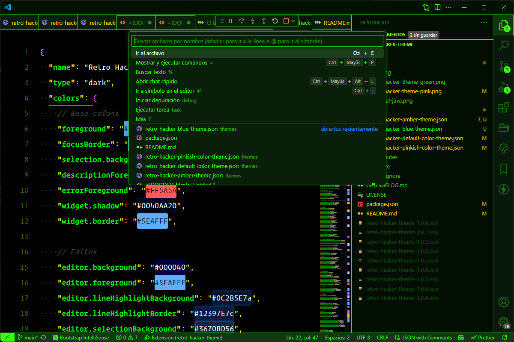
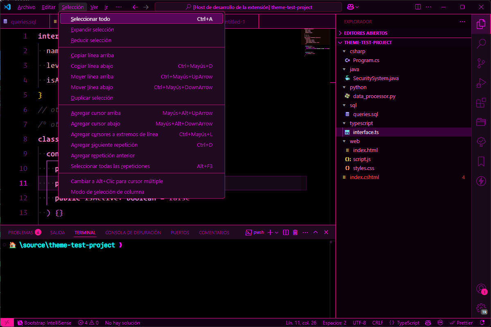

# Retro Hacker Theme for VS Code 🚀

[](https://marketplace.visualstudio.com/items?itemName=devxi.retro-hacker-theme)
[](https://marketplace.visualstudio.com/items?itemName=devxi.retro-hacker-theme)
[](https://marketplace.visualstudio.com/items?itemName=devxi.retro-hacker-theme)

A carefully crafted VS Code theme inspired by classic hacker movies and retro computing. Features a high-contrast dark theme with neon green accents and carefully selected complementary colors for optimal readability during those long coding sessions.

## 🌟 Features

- 🖥️ High-contrast dark theme optimized for readability
- 💚 Classic hacker-style neon green accents
- 📊 Enhanced visibility for important code elements
- 🔍 Clear distinction between different code components
- 🎯 Special attention to markup and terminal colors

## 📸 Screenshots

### Retro Hacker Green



### Retro Hacker Pink



## 📥 Installation

1. Open VS Code
2. Go to Extensions (Ctrl+Shift+X / Cmd+Shift+X)
3. Search for "Retro Hacker Theme"
4. Click Install
5. Press Ctrl+K Ctrl+T (Cmd+K Cmd+T on macOS)
6. Select "Retro Hacker"

Alternatively, you can install it directly from the VS Code Marketplace:
[Retro Hacker Theme on VS Code Marketplace](https://marketplace.visualstudio.com/items?itemName=publisher.retro-hacker-theme)

## 🔧 Customization

You can override any color in your `settings.json`. Example:

```json
{
  "workbench.colorCustomizations": {
    "[Retro Hacker Green]": {
        "terminal.background": "#000000",
        "terminal.foreground": "#05d805",
        ...
    }
  }
}

{
  "workbench.colorCustomizations": {
    "[Retro Hacker Pink]": {
        "terminal.background": "#000000",
        "terminal.foreground": "#ff00ff",
        ...
    }
  }
}
```

## ✨ Best Experience

For the best experience, we recommend:

- Using a monospace font like [Fira Code](https://github.com/tonsky/FiraCode) or [Cascadia Code](https://github.com/microsoft/cascadia-code)
- Enabling font ligatures if your font supports them
- Setting `editor.renderWhitespace: "all"` for better visibility of whitespace
- Using the integrated terminal for the full retro experience

## 🔌 Supported Languages

Optimized syntax highlighting for:

- Python
- JavaScript/TypeScript
- HTML/CSS
- Java
- C/C++
- C#
- Ruby
- Go
- Rust
- Markdown
- JSON/YAML
- And many more!

## 🤝 Contributing

1. Fork the repository
2. Create your feature branch (`git checkout -b feature/amazing-feature`)
3. Commit your changes (`git commit -m 'Add some amazing feature'`)
4. Push to the branch (`git push origin feature/amazing-feature`)
5. Open a Pull Request

## 🐛 Known Issues

- None at the moment. If you find any issues, please report them on our GitHub repository.

## 📜 License

This project is licensed under the MIT License - see the [LICENSE](LICENSE) file for details.

## 🙏 Acknowledgments

- Inspired by classic hacker movies and retro computing
- Special thanks to the VS Code theme development community
- Thanks to all contributors and users for their feedback and support

## 🚀 About the Author

Created with 💚 by Elmer S.

- [GitHub](https://github.com/elmersh)
- [Twitter](https://twitter.com/elmerdev)

## 💝 Support

If you find this theme helpful, please consider:

- Rating it on the VS Code Marketplace
- Starring the GitHub repository
- Sharing it with your friends and colleagues

---

**Enjoy coding like a classic hacker!** 👨‍💻👩‍💻
